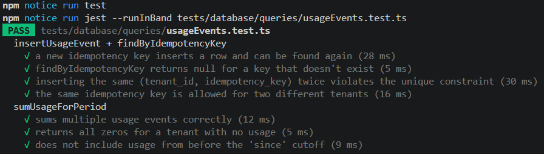
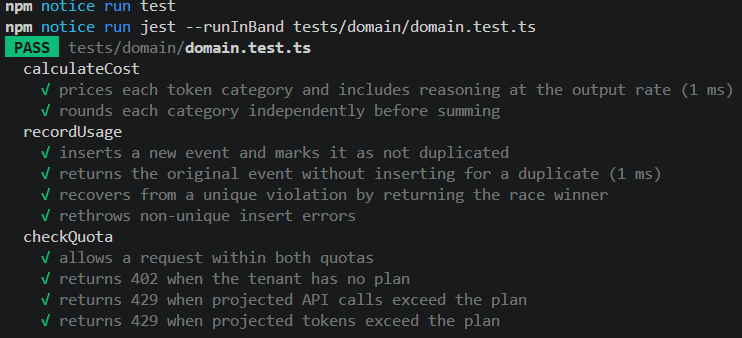
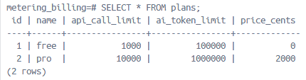
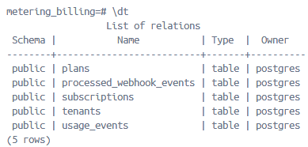
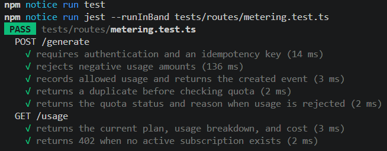

# METERING
- [x] A billable action creates exactly one usage event, even under retries — deduplicated by idempotency key.
```
$ curl -i -X POST http://localhost:3000/generate -H "Authorization: Bearer test_free_key_123" -H "Idempotency-Key: manual-test-1" -d '{"inputTokens": 100, "outputTokens": 200}'
HTTP/1.1 201 Created
{"usageEventId":1,"wasDuplicate":false,"inputTokens":100,"outputTokens":200,...}

$ curl -i -X POST http://localhost:3000/generate -H "Authorization: Bearer test_free_key_123" -H "Idempotency-Key: manual-test-1" -d '{"inputTokens": 999, "outputTokens": 999}'
HTTP/1.1 200 OK
{"usageEventId":1,"wasDuplicate":true,"inputTokens":100,"outputTokens":200,...}
```
Same idempotency key so original values preserved (100+200, not 999+999). No new row created.
- [x] A test proves double-counting cannot happen.
```
npm test -- --runInBand tests/database/queries/usageEvents.test.ts
```


# QUOTAS
- [x] Usage is checked against the tenant's plan; requests over the limit are rejected.
```
$ npm run seed:near-quota
Tenant 1 (test_free_key_123) now has 999/1000 API calls used.

$ curl -i -X POST .../generate ... (1000th call)
HTTP/1.1 201 Created

$ curl -i -X POST .../generate ... (1001st call)
HTTP/1.1 429 Too Many Requests
{"error":"API call quota exceeded: 1001/1000 for the free plan this period."}
```
- [x] Responses carry the correct status codes ( 429 / 402 ) and a message explaining why.
```
npm test -- --runInBand tests/domain/domain.test.ts
```


# COST CALCULATION
- [x] Monthly usage rolls up into a cost figure per tenant.
- [x] AI token pricing handles cached input tokens, reasoning tokens, and output pricing correctly.
- [x] Pricing constants are pinned and covered by tests.  
Via docker-desktop

# STRIPE INTEGRATION
- [ ] Subscription checkout works end-to-end in Stripe test mode.
- [ ] Webhooks verify signatures, ignore duplicate events, and update tenant plan/status.
# DATA MODEL, TESTS & DOCUMENTATION
- [x] Database includes tenants, plans, subscriptions, and usage events; customer data isolated per tenant.  
Via docker-desktop:  


- [x] Tests cover: duplicate usage prevention, quota boundary cases (at / just under / over), cost calculations, invalidwebhook rejection, duplicate-webhook handling.
```
npm test -- --runInBand metering.test.ts
```

- [ ] README + architecture diagram + setup instructions; submission-pack files from § 11 present.